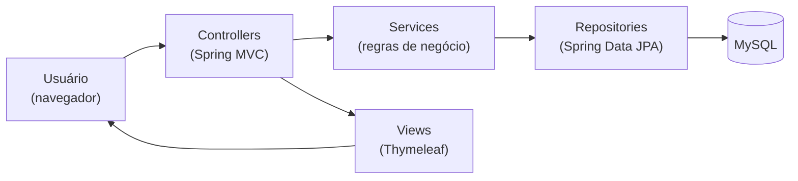

# sigeest-v1

<p align="center">
  
</p>

**SIGEEST (Sistema de Gerenciamento de Estruturas)** — aplicação web para
**inventário e controle de ativos de uma rede de telecomunicações / provedor de
internet**: as torres e pontos de transmissão, os equipamentos de rede instalados
neles, as baterias de backup, os fabricantes e o estoque de onde cada peça sai e
para onde volta. Tudo operado por usuários com controle de acesso por papéis.

Foi desenvolvido como **Trabalho de Conclusão de Curso** (Análise e
Desenvolvimento de Sistemas, 2018) em **Java + Spring Boot**, com telas
renderizadas no servidor (Thymeleaf) e persistência em **MySQL**.

## A ideia

Um provedor lida com um patrimônio que vive em movimento: equipamentos e baterias
saem do estoque, são instalados numa torre, vão para manutenção e voltam. Sem um
controle central, isso se perde em planilhas. O SIGEEST centraliza esse ciclo e
responde, a qualquer momento, **onde está cada ativo, em que status, e quem pode
mexer nele**.

A aplicação segue o padrão **MVC em camadas** do Spring:



1. **Usuário** autentica (Spring Security) e navega pelos módulos.
2. **Controllers** recebem a requisição, validam os dados e escolhem a tela.
3. **Services** aplicam as regras de negócio e orquestram os repositórios (ex.:
   alocar um equipamento mexe em estrutura, estoque e equipamento ao mesmo tempo).
4. **Repositories** (Spring Data JPA) gravam/leem no **MySQL** via Hibernate.
5. **Views** (Thymeleaf) devolvem o HTML já renderizado — o menu mostra só o que
   o papel do usuário permite.

> O ciclo de vida dos ativos é guardado no próprio modelo: cada equipamento/bateria
> tem status `INDEFINIDO → DESALOCADO (em estoque) → ALOCADO (em uso) → MANUTENCAO`,
> com transições controladas.

## Funcionalidades

- **Estruturas** (torres): cadastro/edição/exclusão/pesquisa, tipo
  (Transmissão/Recepção/Repetição), coordenadas com **visualização em mapa**, e
  **alocação/remoção** de equipamentos e baterias.
- **Equipamentos** (CPE, switch, roteador, conversor, modem): CRUD + validação de
  **MAC**, envio e retorno de manutenção.
- **Baterias** (VRLA, no-break, estacionária): CRUD por **número de série** +
  manutenção.
- **Fabricantes** e **Estoques**: CRUD, com estoque georreferenciado.
- **Usuários, Grupos e Permissões**: autenticação e **autorização por papéis**
  (PESQUISAR, CADASTRAR, EDITAR, EXCLUIR, ADICIONAR, REMOVER).

## Estrutura do projeto

| Caminho | Para que serve |
|---|---|
| `sigeest/pom.xml` | Dependências e build (Maven / Spring Boot 1.5.9). |
| `sigeest/mvnw`, `mvnw.cmd` | Maven Wrapper — buildar sem Maven instalado. |
| `sigeest/src/main/java/br/com/sigeest/control/` | Controllers (Spring MVC) — uma classe por ação. |
| `.../service/` | Regras de negócio e orquestração. |
| `.../repository/` | Interfaces Spring Data JPA. |
| `.../model/` | Entidades JPA do domínio (herança via `@MappedSuperclass`). |
| `.../enums/` | Tipos, status e setores. |
| `.../security/`, `.../config/` | Spring Security (usuário, autoridades, regras de acesso). |
| `.../converters/` | Conversores de data Java 8 ↔ SQL. |
| `sigeest/src/main/resources/templates/` | Telas Thymeleaf (`.html`). |
| `sigeest/src/main/resources/static/` | CSS, JS e imagens (Bootstrap, jQuery, mapa). |
| `sigeest/src/main/resources/application.properties` | Datasource e configuração do JPA. |
| `assets/sigeest-logo.svg` | Logo do projeto (usada neste README). |

## Stack

| Tecnologia | Papel |
|---|---|
| **Java 8 + Spring Boot 1.5.9** | Base da aplicação, autoconfiguração e servidor embarcado. |
| **Spring MVC + Thymeleaf** | Controllers e telas renderizadas no servidor. |
| **Spring Data JPA + Hibernate** | Persistência e mapeamento objeto-relacional. |
| **Spring Security** | Autenticação por formulário e autorização por papéis. |
| **MySQL** | Banco de dados relacional. |
| **Bootstrap 3 + jQuery** | UI responsiva e interatividade (DataTables, máscaras, datepicker). |
| **Google Maps API** | Localização geográfica das estruturas. |

## Modelo de dados

| Entidade | Representa |
|---|---|
| `Estrutura` | Torre/ponto de rede (herda `Localidade`: endereço, lat/long, elevação). |
| `Equipamento` | Ativo de rede com MAC único (herda `Componente`). |
| `Bateria` | Energia de backup com serial único (herda `Componente`). |
| `Fabricante` | Fornecedor de equipamentos e baterias. |
| `Estoque` | Almoxarifado georreferenciado (herda `Localidade`). |
| `Usuario` / `Grupo` / `Permissao` | Operadores e controle de acesso por papéis. |

Um **Equipamento**/**Bateria** pertence a um **Fabricante** e está sempre numa
**Estrutura** (em uso) **ou** num **Estoque** (disponível). **Grupo ↔ Permissão**
é muitos-para-muitos. O schema é gerado pelo Hibernate (`ddl-auto=update`).

## Pré-requisitos

1. **JDK 8** (o projeto declara `java.version` 1.8).
2. **MySQL** em execução local, com um banco chamado **`SIGEESTBD`**:
   ```sql
   CREATE DATABASE SIGEESTBD;
   ```
3. As credenciais do banco ficam em
   `sigeest/src/main/resources/application.properties` — **ajuste para o seu
   ambiente** antes de subir.

> Não há script de carga inicial (*seed*). Para conseguir logar, é preciso ter ao
> menos um usuário, um grupo e suas permissões cadastrados no banco.

## Como rodar

A partir da pasta `sigeest/`:

```bash
# Linux/Mac
./mvnw spring-boot:run

# Windows
mvnw.cmd spring-boot:run
```

A aplicação sobe em `http://localhost:8080`. Para gerar o artefato empacotado:

```bash
./mvnw clean package      # gera o .jar em target/
```

## Observações de segurança

> Este é um projeto acadêmico de 2018. Alguns pontos refletem práticas da época e
> **devem ser endurecidos antes de qualquer uso real**:

- As **senhas são gravadas em texto puro** (sem hash). O padrão atual é usar um
  `PasswordEncoder` (ex.: BCrypt).
- As **credenciais do banco estão no `application.properties`** — em produção,
  movê-las para variáveis de ambiente / cofre de segredos e não versioná-las.
- `ddl-auto=update` deixa o Hibernate alterar o schema automaticamente — útil em
  estudo, arriscado em produção (prefira migrações versionadas).

## Licença

Distribuído sob a **GNU General Public License v3.0 (GPL-3.0)**. Veja o arquivo
[`LICENSE`](LICENSE).
